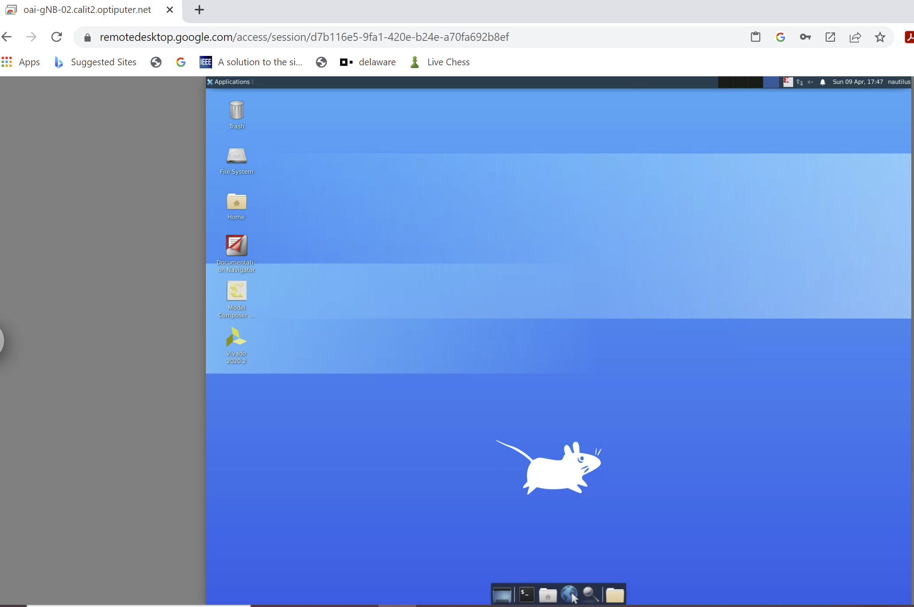

* You will first need to [get an account and SSH](./login.md) into the nautilus server.

## Using VNC Server

* Install any VNC Client on your local machine (for example, https://remmina.org/, https://www.realvnc.com/en/connect/download/vnc/, or https://www.tightvnc.com/download.php)
* On the Nautilus machine, start a new VNC server `vncserver :3 -depth 32 -geometry 1920x1080 -httpPort 5903`
* On your local machine, open an SSH Tunnel to the host server `ssh -i YOUR_KEY nautilus@216.165.12.75 -L 5903:127.0.0.1:5903`
* On your local machine, open the VNC Client you installed in the first step and connect to `127.0.0.1:5903`. The password is `123456`
* You should be in! For the best graphical performance (depending on your connection), select “High” as the picture quality option. Or similar, depending on your VNC Client.

* Some VNC server utils:
    * `ss -tulpn | egrep -i 'vnc|590'` or `vncserver -list` (checks and lists if any VNC server is running)
    * `vncserver -kill :*` (kills all vncsever instances currently active)
    * `vncserver -kill :1` (kills the vncserver instance on display 1)
    * The tutorial above assumes the use of port `5903`, but any port can work. A good practice will be to check what instances are currently running and open your vncserver on a different port

## Using Chrome Remote Desktop

Google's [Chrome Remote Desktop](https://remotedesktop.google.com/home) is a simple,
powerful, and completely free way to access full screens on remote servers.
You may choose to use Chrome Remote Desktop for the Nautilus server,
if you prefer access with a full screen instead of a command line accessible
from an SSH window.

* On your local machine, go to the [Chrome Remote Desktop access page](https://remotedesktop.google.com/access/).
On the left, select "Set up via SSH".
* Select "Setup another computer"
* The first instruction will be "Download and install Chrome Remote Desktop on the remote computer".
You can skip this step since it has already been set up, so just select "Next"
* On the next screen, select "Authorize".
* You will be given a command for various types of remote machines.  Copy the
command for "Debian Linux".  Paste this command into the SSH terminal on the
remote machine.
    * Note this command is only valid for a few minutes.  If you do not copy
    the command in time, you will need to repeat this step to get a new
    command.
    * After pasting in the command, you will be prompted for a PIN.
    * It may say it is stopping the existing host and take a few minutes.
* Return to the [Chrome Remote Desktop access page](https://remotedesktop.google.com/access/)
and select "Remote access" on the left.  The remote machine with a name
such as `oai-gNB-02.calit2.optiputer.net` should be available.  Select
that machine.  You will be asked to enter the PIN you entered in the previous step.
* You will now see a screen similar to the image above.
* You may wish to adjust the screen resolution.  To change the resolution,
right click in the main window and select "Applications->Settings->Display".

